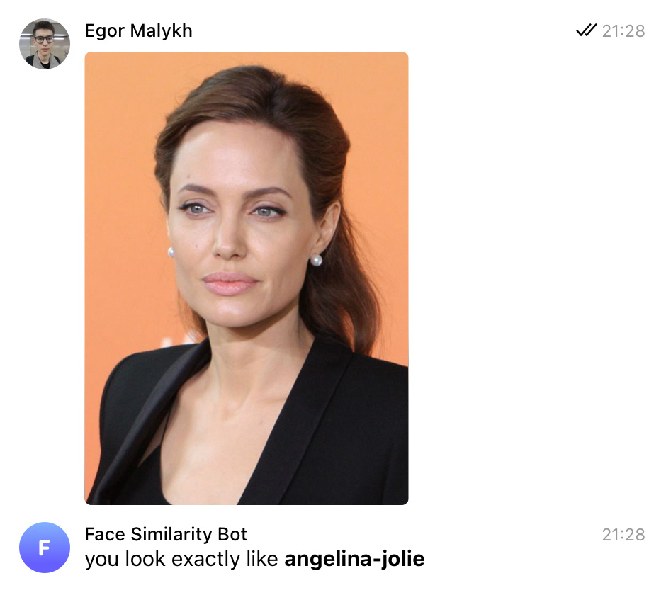

# Face Similarity Bot

This is a Telegram bot that will identify which person you most closely resemble. It requires several photos of different people to work.



## Usage

  1. Clone this repository:

     ```shell script
     git clone https://github.com/meownoid/face-similarity-bot.git
     ```

  2. Put images to the `photos` folder. One image per person. Name of the person will be taken from the file name.

  3. Install requirements. This step may take a while because dlib library will be compiled from the sources.

     ```shell script
     pip install -r requirements.txt
     ```

  4. Optionally change paths in the `config.py`.

  5. Run `prepare.py` to download pretrained models and to create the embeddings:

     ```shell script
     python prepare.py
     ```

  6. Replace the token in the `config.py`:

     ```python
     TOKEN = '<TOKEN>'
     ```

  7. Start the bot:

     ```shell script
     python bot.py
     ```
